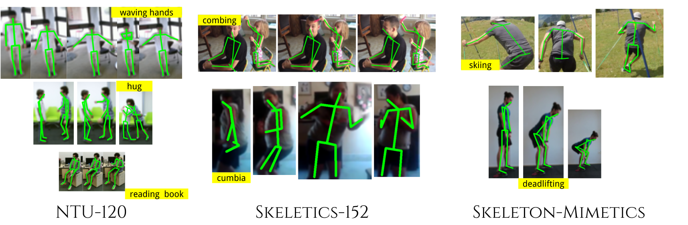

[](https://paperswithcode.com/sota/skeleton-based-action-recognition-on-ntu-rgbd-1?p=quo-vadis-skeleton-action-recognition)

# Quo Vadis, Skeleton Action Recognition ?

This repository contains datasets and scripts for the paper <a href="https://arxiv.org/pdf/2007.02072v1.pdf">Quo Vadis, Skeleton Action Recognition ?</a>, accepted for publication at International Journal of Computer Vision <i> IJCV </i>.

This paper primarily contributes towards benchmarking of exisiting skeleton human action recognition models on larger datasets like <a href = "http://rose1.ntu.edu.sg/Datasets/actionRecognition.asp">NTU-120</a> and also provides insight on how these models performs for *in the wild* data as well.



We also introduce 3 new skeleton human action datasets:

- [Skeletics-152](./skeletics-152/)
- [Skeleton-mimetics](./skeleton-mimetics/)
- [Metaphorics](./metaphorics/)

The details about each of these datasets can be found in [skeletics-152 README](./skeletics-152/README.md), [skeleton-mimetics README](./skeleton-mimetics/README.md) and [metaphorics README](./metaphorics/README.md).

### Pre Trained models

This repository contains pre-trained model weights for all the models that were trained as mentioned in the paper. The weights of different models for different datasets can be found [here](./Pre%20Trained%20Models/)

### Scripts

The scripts needed to parse VIBE skeleton data into usable VA-CNN and GCN formats can be found [here](./Scripts/)

### Citation
```
@misc{gupta2020quo,
    title={Quo Vadis, Skeleton Action Recognition ?},
    author={Pranay Gupta and Anirudh Thatipelli and Aditya Aggarwal and Shubh Maheshwari and Neel Trivedi and Sourav Das and Ravi Kiran Sarvadevabhatla},
    year={2020},
    eprint={2007.02072},
    archivePrefix={arXiv},
    primaryClass={cs.CV}
}
```
