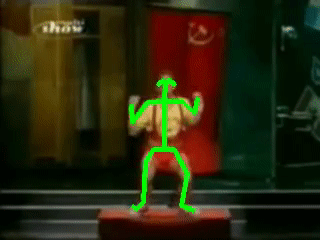
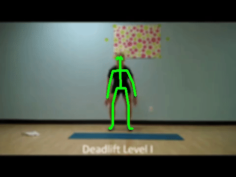
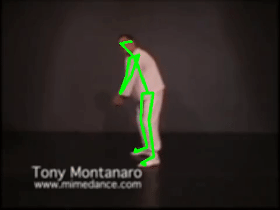

# Skeleton - mimetics

### Introduction

The original Mimetics data was released by [Naver Labs](https://europe.naverlabs.com/research/computer-vision-research-naver-labs-europe/mimetics/).

The Mimetics dataset contains 713 video clips from YouTube of mimed actions for a subset of 50 classes from the Kinetics400 dataset.

It allows to evaluate on out-of-context human actions methods that have been trained on Kinetics.

The <b>Skeleton Mimetics</b> dataset is carefully curated version of the original Mimetics datasets. Only <b>23</b> classes which corresponds to human action recognition are included in this dataset along with skeleton data obtained using VIBE pose estimator.

<table >
  <tr>
    <th/>
    <th>Number of classes</th>
    <th>Number of Samples</th>
  </tr>

  <tr>
    <td>Mimetics</td>
    <td>50</td>
    <td>713</td>
  </tr>

  <tr>
    <td>Skeleton Mimetics</td>
    <td>23</td>
    <td>319</td>
  </tr>
</table>

### Downalod Dataset

Skeleton Mimetics dataset can be downloaded from this <a href = "">link</a>

A .zip file will be downloaded from this link which will contain folders with the name of different classes and inside each folder there will be json files containing VIBE skeleon results for different video samples in that class.

### Dataset preparation

To obtain 3d skeletons from the RGB video, [VIBE pose estimation model](https://github.com/mkocabas/VIBE) is used. VIBE pose estimate gives 49 joints in total out of which we are choosing the first <b>25</b>
body joints common with [Openpose](https://github.com/CMU-Perceptual-Computing-Lab/openpose). The joint ordering for Openpose is [here](https://github.com/CMU-Perceptual-Computing-Lab/openpose/blob/master/doc/output.md#keypoint-ordering-in-cpython).

### Samples

Some samples of the vibe skeleton estimations on the RGB video are shown below.

<table>
<tr>
  <td>
    
  </td>
  <td>
    
  </td>
  <td>
    
  </td>
</tr>

<tr>
  <td align="center">Clean And Jerk</td>
  <td align="center">Deadlifting</td>
  <td align="center">Golf</td>
</tr>

</table>

### Selected Classes

<table>

<tr>
 <td align = "center">playing guitar</td>
 <td align = "center">playing violin</td>
 <td align = "center">catching or throwing frisbee</td>
</tr>
<tr>
 <td align = "center">deadlifting</td>
 <td align = "center">reading book</td>
 <td align = "center">sword fighting</td>
</tr>
<tr>
 <td align = "center">punching person (boxing)</td>
 <td align = "center">golf driving</td>
 <td align = "center">catching or throwing baseball</td>
</tr>
<tr>
 <td align = "center">playing accordion</td>
 <td align = "center">shooting goal (soccer)</td>
 <td align = "center">playing tennis</td>
</tr>
<tr>
 <td align = "center">hitting baseball</td>
 <td align = "center">clean and jerk</td>
 <td align = "center">juggling soccer ball</td>
</tr>
<tr>
 <td align = "center">sweeping floor</td>
 <td align = "center">dunking basketball</td>
 <td align = "center">playing saxophone</td>
</tr>
<tr>
 <td align = "center">skiing slalom</td>
 <td align = "center">archery</td>
 <td align = "center">bowling</td>
</tr>
<tr> 
 <td align = "center">climbing a rope</td>
 <td align = "center">dribbling basketball</td>
</tr>

</table>
